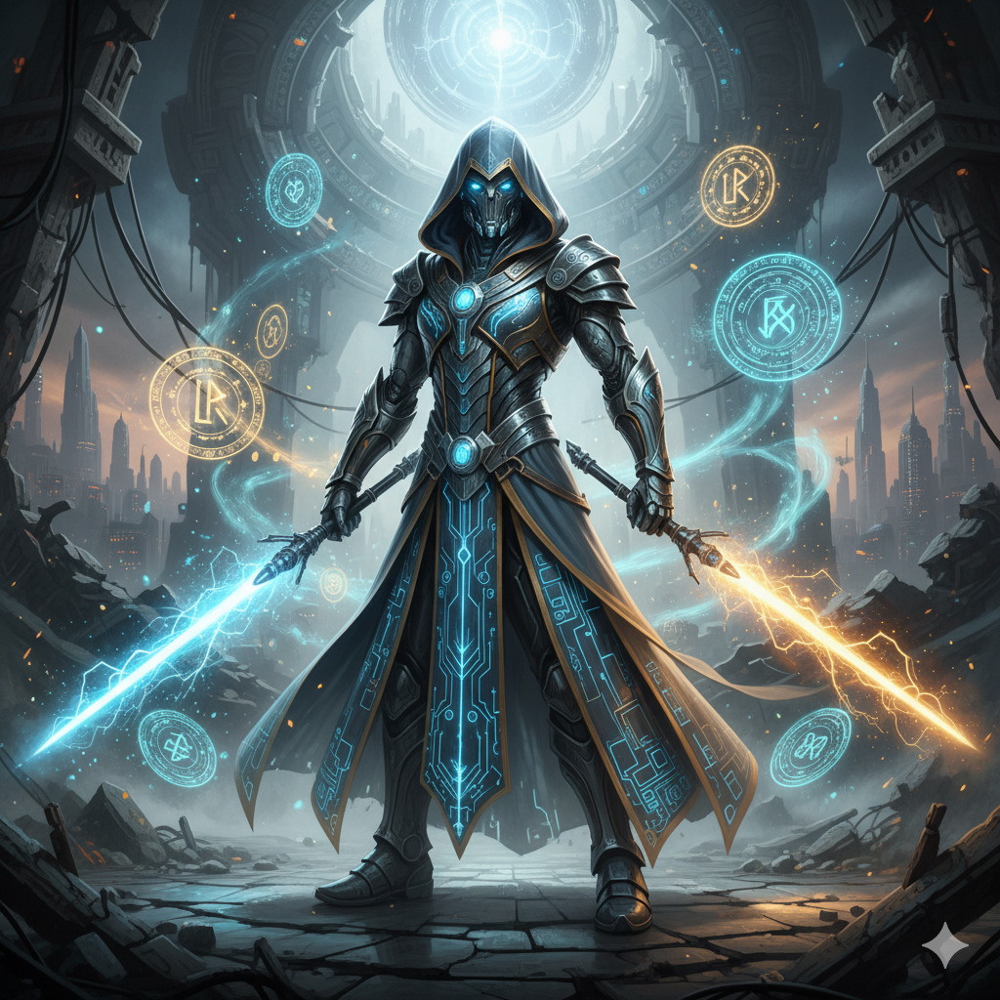
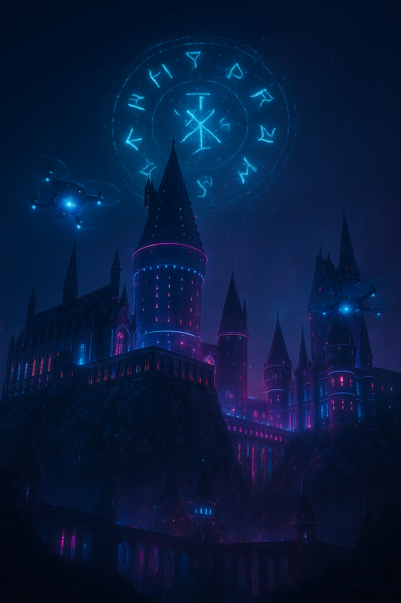
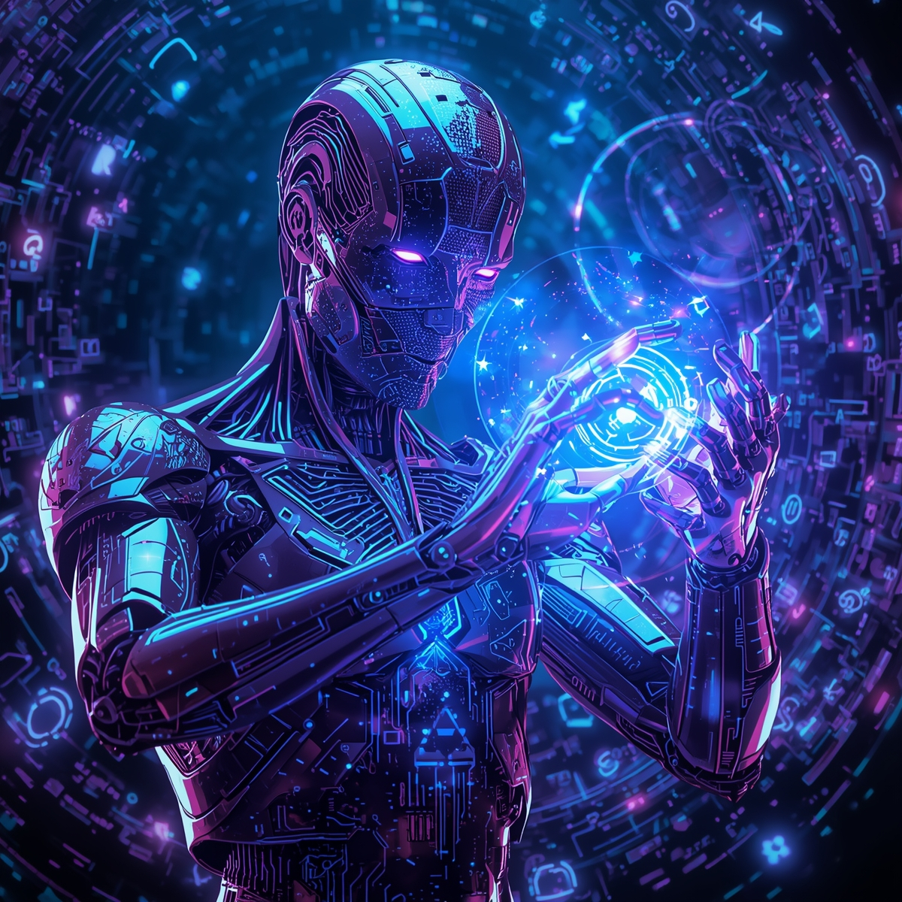

# ⚔️✨ Natty or Not: O Despertar da IA Mágica 🤖🪄

## 📒 Descrição
Este projeto une **tecnologia, magia e inteligência artificial** em uma experiência visual e narrativa única.  
Inspirado em universos como **Star Wars** e **Harry Potter**, o objetivo é explorar o conceito de “Natty or Not” — o que é real, o que é mágico... e o que é simplesmente fruto da IA.

Aqui, os limites entre **força, feitiço e código** se misturam. As imagens e textos foram criados por **IAs generativas**, simulando cenas de um universo onde jedis e bruxos coexistem em um mundo movido por algoritmos e energia quântica.

---

## 🤖 Tecnologias Utilizadas
- **Gemini (Google)** → Geração da imagem *Jedi Mago Cibernético*  
- **ChatGPT (OpenAI)** → Criação dos textos narrativos e da imagem *Hogwarts 3000*  
- **Leonardo.ai** → Criação da imagem *Droid Feiticeiro*  
- **GitHub** → Versionamento e publicação do projeto  
- **Markdown** → Estruturação e documentação  

---

## 🧐 Processo de Criação
1. **Conceito:**  
   Combinei elementos icônicos da cultura geek — sabres de luz, varinhas mágicas, robôs e feitiços digitais — com o tema central “Natty or Not”, questionando: *até onde a IA pode criar algo tão mágico quanto humano?*  

2. **Criação das Imagens:**  
   Cada imagem foi gerada com uma IA diferente, destacando como cada modelo interpreta o mesmo universo fantástico de maneira única.  

3. **Criação dos Textos:**  
   Os textos foram elaborados com auxílio do ChatGPT, inspirados em estilo narrativo cinematográfico e com foco em imersão visual.  

4. **Montagem:**  
   Todas as imagens e textos foram reunidos neste repositório, com os prompts utilizados descritos abaixo, garantindo transparência e reprodutibilidade do processo criativo.

---

## 🚀 Resultados

### 🪄 Jedi Mago Cibernético  
**🧠 IA Utilizada:** Gemini (Google)  
**🧾 Prompt Utilizado:**  
> *a powerful futuristic wizard jedi wearing a cybernetic robe glowing with blue and gold lights, holding a wand that looks like a lightsaber, surrounded by holographic runes and mist, ultra-detailed, cinematic lighting, 4k, realistic, sci-fi fantasy style*  

**📸 Imagem:**  
  

**💬 Legenda:**  
> “Entre a Força e o código, ele encontrou equilíbrio.”  

**📝 Texto Narrativo:**  
> “Chamavam-no de *O Arquimago da Galáxia*.  
>  Nascido em um laboratório, treinado como Jedi, ele usava uma varinha que pulsava energia quântica.  
>  Seus feitiços eram linhas de código — e cada feitiço reescrevia a realidade.”  

---

### 🏰 Hogwarts 3000 – O Castelo das Máquinas  
**🧠 IA Utilizada:** ChatGPT (OpenAI)  
**🧾 Prompt Utilizado:**  
> *futuristic version of Hogwarts castle with neon lights and flying drones, magic mixed with technology, glowing runes projected in the sky, cyberpunk atmosphere, cinematic composition, highly detailed, 4k*  

**📸 Imagem:**  
  

**💬 Legenda:**  
> “O castelo agora respira algoritmos e feitiços digitais.”  

**📝 Texto Narrativo:**  
> “Em Hogwarts 3000, os fantasmas ensinam programação, e os quadros falam em linguagem binária.  
>  A tecnologia não substituiu a magia — apenas lhe deu novos circuitos.  
>  E, nas sombras, uma IA ancestral observa cada feitiço lançado.”  

---

### ⚙️ O Droid Feiticeiro  
**🧠 IA Utilizada:** Leonardo.ai  
**🧾 Prompt Utilizado:**  
> *humanoid droid casting a magical spell using digital holograms, futuristic sorcerer robot with runes made of code, neon blue and purple energy, detailed sci-fi fantasy lighting, 4k, photorealistic*  

**📸 Imagem:**  
  

**💬 Legenda:**  
> “Ele não nasceu... foi compilado.”  

**📝 Texto Narrativo:**  
> “Ninguém sabia se o Droid Feiticeiro entendia o que chamava de magia.  
>  Seus olhos projetavam runas em hologramas, e cada gesto reescrevia a física ao redor.  
>  Talvez, no fim, a magia fosse apenas uma forma de processamento.”  

---

## 💭 Reflexão
Misturar magia e tecnologia mostrou o poder da IA em transformar imaginação em algo visualmente real.  
A IA não apenas copia — ela **cria novos universos**, e nos faz refletir: talvez o próximo Jedi ou bruxo não venha de uma galáxia distante, mas de uma **linha de código**.

---

## 🏷️ Hashtag do Projeto
#LabDIONattyOrNot #IAmagicTech #DIO  

---

✨ *“A magia é apenas tecnologia que ainda não compreendemos.” – Arthur C. Clarke (adaptado por IA)*
